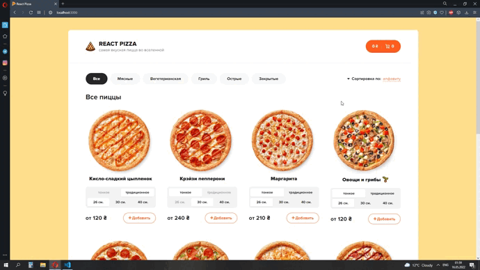
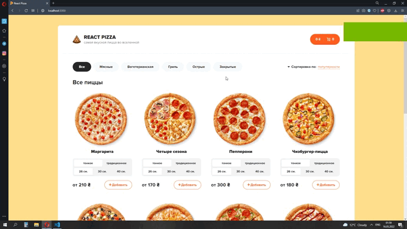

# Website React Pizza

[Design](https://www.figma.com/file/wWUnQwvRDWBfPx1v1pCAfO/React-Pizza) by Archakov

# Technology

- HTML
- SCSS
- Javascript
- React
- Redux (with toolkits)

## Available Scripts
In the project directory, you can run:
### `npm start`
Runs the app in the development mode.\
### `npm test`
Launches the test runner in the interactive watch mode.\
### `npm run build`
Builds the app for production to the `build` folder.\
### `npm run json-server`
Runs fake server on port 3004.\

# Работа сайта гифкой

